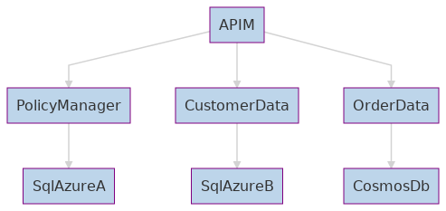

# Authorization Service End to End Example

 [](https://lgtm.com/projects/g/jwendl/authorization-service-example/alerts/)

## Introduction 

This is an Azure Function application that creates an authorization service which utilizes ABAC and PBAC principals to grant access to various microservices. 

The overall architecture includes APIM, Azure Functions, Azure SQL Database, Cosmos Database and Azure Active Directory components.

More information about each component exists as [PolicyManager](./src/Authorization/README.md), [CustomerData](./src/CustomerData/README.md) and [OrderData](./src/OrderData/README.md)



## Getting Started

1. Clone the repository
2. Open the ApiExampleProject\ApiExampleProject.sln file with Visual Studio
3. Right click the API you'd wish to run locally (PolicyManager, CustomerData, OrderData) and select "Set as Startup Project"

## Build and Test

### Visual Studio

1. Open the ApiExampleProject\ApiExampleProject.sln file with Visual Studio
2. Right click the API you'd wish to run locally (PolicyManager, CustomerData, OrderData) and select "Set as Startup Project"

### Using Bash or WSL

``` bash
pushd src
dotnet build ApiExampleProject.sln
cd src/Authorization/PolicyManager/
dotnet run PolicyManager
pushd 

popd
popd
```

### Visual Studio Code

TBD

## Contributing

Contributing is easy 🙏. Look for an issue that is tagged as ["good first issue"](https://github.com/jwendl/authorization-service-example/issues?q=is%3Aissue+is%3Aopen+label%3A%22good+first+issue%22), fork this repo, make your contributions and then create a PR. See the [Guide](https://guides.github.com/introduction/flow/) for more information.
